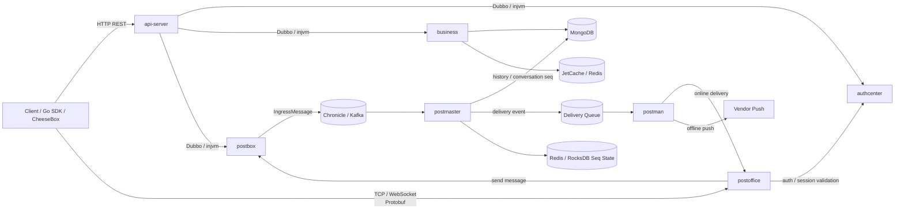

# CheeseIM

CheeseIM is a self-hosted open-source IM system. The repository contains the Java server, a reusable Go client SDK, the CheeseBox TUI client, and design documents. Server-side responsibilities are split into HTTP API, auth/session, business domain services, long-connection gateway, message ingress, message orchestration, and delivery/push modules. For local development, `bootstrap-all` is the recommended entry point because it runs the full server stack in one JVM.

[中文](README.md)

## Architecture



## Modules

| Module | Responsibility |
| --- | --- |
| `server/api-server` | Unified HTTP entry. Controllers handle REST requests, principal resolution, facade orchestration, and response mapping only. |
| `server/authcenter` | Access/refresh tokens, WS/TCP tickets, session lifecycle, device kickoff, and connection auth. |
| `server/business` | User, friend, blacklist, group membership, conversation, and sync-point domain services. |
| `server/postoffice` | TCP/WebSocket gateway, Protobuf codecs, connection management, online routes, heartbeats, kickoff, and online delivery. |
| `server/postbox` | Message sending entry and history query entry. Implements `MessageSender` and publishes ingress events. |
| `server/postmaster` | Message orchestration. Consumes ingress events, allocates conversation/user seq, writes history blocks, and emits delivery events. |
| `server/postman` | Delivery and offline push. Consumes delivery/offline events and dispatches online messages or vendor push requests. |
| `server/common-api` | Cross-module APIs, domain models, enums, events, and Protobuf definitions. |
| `server/common-core` | Shared infrastructure: Mongo repositories, queue abstraction, JetCache, notifications, seq state, and utilities. |
| `server/config` | Spring/YAML configuration for all-in-one and module deployments. |
| `server/bootstrap-all` | Recommended local development entry. Runs all modules in one JVM with Dubbo injvm. |
| `sdks/go` | Reusable Go IM client SDK. |
| `apps/CheeseBox` | TUI chat application built on top of the Go SDK. |

## Implemented Features

- HTTP auth: login, refresh, logout, device kickoff, and WS/TCP ticket issuing.
- TCP/WS long connection protocol based on Protobuf envelopes.
- Message pipeline: ingress, option policy, seq allocation, history persistence, online delivery, and offline push events.
- Conversation sync: visible conversations, conversation ID hash, max seq, read snapshots, pull by seq ranges, and read seq ACK.
- Social APIs: user settings, friend requests, friendships, blacklist, and group member query.
- Notification sending through `NotificationSender` and `MessageSender`.
- Go SDK and CheeseBox TUI client for real end-to-end testing.

## Key Constraints

- `api-server` owns HTTP Request/Response models. Lower-level services should return domain models or primitive results.
- `authcenter` owns token, ticket, session, and connection-auth logic. `postoffice` owns connection state and online routes.
- TCP/WS protocol is defined by `common-api/src/main/proto/message_protocol.proto`; JSON command payloads are no longer the source of truth.
- Conversation lists do not store latest-message snapshots. Clients should cache the latest message or pull messages on demand.
- Message seq allocation must use the conversation/user seq state pipeline. Do not replace it with the generic `SequenceIdGenerator`.
- Redis is required for clustered cache and seq allocation state. Single-node deployments can degrade to local RocksDB state, but that does not provide cross-node global consistency.
- `bootstrap-all` is the recommended development mode. Split-module deployment requires aligned `spring.config.name` values and a real Dubbo registry.

## Development

Recommended prerequisites:

- JDK 17
- Repository Gradle Wrapper
- MongoDB 6.x+
- Redis 6.x+
- Optional Kafka/Nacos for split-module or queue experiments
- Go 1.22+ for `sdks/go` and `apps/CheeseBox`

Start the full server locally:

```bash
cd server
./gradlew :bootstrap-all:bootRun
```

Default ports:

| Service | Port |
| --- | --- |
| HTTP API | `18079` |
| WebSocket | `5147`, default path `/ws` |
| TCP | `5148` |
| Dubbo | injvm in all-in-one mode |

Example login:

```bash
curl -sS -X POST http://127.0.0.1:18079/api/auth/login \
  -H 'Content-Type: application/json' \
  -d '{"userId":"u100","platformId":1,"deviceId":"dev-u100","clientVersion":"dev"}'
```

Example ticket request:

```bash
curl -sS -X POST http://127.0.0.1:18079/api/im/ws-ticket \
  -H "Authorization: Bearer ${ACCESS_TOKEN}"
```

Run CheeseBox:

```bash
cd sdks/go
go test ./...
```

```bash
cd apps/CheeseBox
go test ./...
go run ./cmd/cheesebox
```

## Testing

Compile the server:

```bash
cd server
./gradlew compileJava
```

Run module tests:

```bash
./gradlew :api-server:test
./gradlew :business:test
./gradlew :postoffice:test
./gradlew :postmaster:test
./gradlew :postbox:test
./gradlew :postman:test
```

For end-to-end testing, start MongoDB and Redis, run `:bootstrap-all:bootRun`, then launch two CheeseBox clients with different users and verify online delivery plus history sync after restart.
