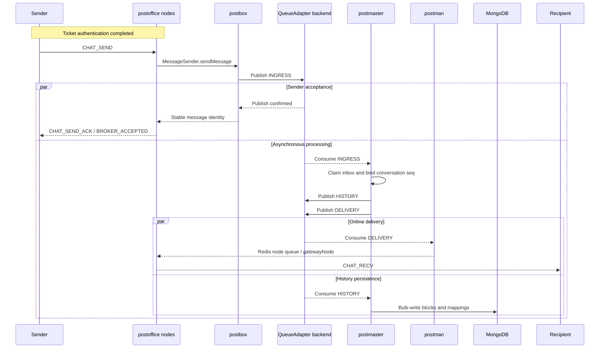

# CheeseIM

**A modular instant messaging system for self-hosted deployments.**

The Java server separates the HTTP control plane, TCP/WS realtime transport, and asynchronous message pipeline. A reusable Go client SDK and the CheeseBox TUI support dual-client integration from login and sending to history recovery.

[中文](README.md) · [Architecture](#architecture) · [Quick start](#quick-start) · [Capabilities](#capabilities-and-acceptance) · [Modules](#modules-and-repository) · [Documentation](#development-and-documentation)

- **Clear message responsibilities**: `postoffice` owns connections, `postbox` accepts messages, `postmaster` orchestrates and sequences them, and `postman` delivers them.
- **Recoverable state**: stable message identity, conversation seq, history blocks, device receipts, and control-event cursors have distinct roles.
- **One codebase, two deployment shapes**: use `bootstrap-all` in one JVM locally, or independent services with Kafka and shared state in a cluster.

The project is under active integration and acceptance testing. Core paths are implemented; cluster capacity, failure recovery, and parts of the client remain work in progress. See the [remediation acceptance ledger](docs/review-remediation-plan-2026-09-30.md) for current status.

## Architecture

### Service overview


**Solid arrows are transport/RPC; dashed arrows are asynchronous queues. Gray nodes are stores or external providers.** This is a logical service view, not a Gradle dependency graph or a requirement to deploy every node separately.

1. **Control plane**: clients use `api-server` for login, tickets, social APIs, and sync. `authcenter` owns authentication; `business` owns domain operations and access checks. History and mutation queries also call `postbox` and `postmaster` respectively.
2. **Message pipeline**: `postoffice → postbox → INGRESS → postmaster → DELIVERY → postman`. Conversation seq uses a single allocator; user-scoped watermarks are advanced afterwards.
3. **Delivery and recovery**: Redis node queues direct online messages to the `postoffice` identified by `gatewayNode`; offline events use vendor push. A `HISTORY` consumer persists history to MongoDB asynchronously. Clients recover messages and control events through HTTP seq ranges and cursors.

Normal groups use a fanout worker inside `postmaster`; super groups use history storage and client pulls. Auxiliary auth RPCs, delivery outcomes, and control-event compensation edges are omitted from the overview. See the [architecture assessment](server/docs/architecture/ASSESSMENT.md) and [protocol boundary](docs/PROTOCOL.md) for details.

### What does success mean?

| State | Confirms | Does not yet confirm |
| --- | --- | --- |
| `CHAT_SEND_ACK / BROKER_ACCEPTED` | The ingress operation confirmed publication and returned a stable message identity | History persistence or recipient receipt |
| Device receipt `CHAT_DELIVERY` | The client explicitly acknowledged its device delivery watermark; CheeseBox sends it after local persistence | User reading |
| Read receipt `CHAT_READ` | The user's read watermark advanced | Every device has displayed the receipt |

<details>
<summary><strong>Expand: ordinary persistent message sequence</strong></summary>


```mermaid
sequenceDiagram
    participant S as Sender
    participant G as postoffice nodes
    participant B as postbox
    participant Q as QueueAdapter backend
    participant M as postmaster
    participant P as postman
    participant DB as MongoDB
    participant R as Recipient

    Note over S,G: Ticket authentication completed
    S->>G: CHAT_SEND
    G->>B: MessageSender.sendMessage
    B->>Q: Publish INGRESS
    par Sender acceptance
        Q-->>B: Publish confirmed
        B-->>G: Stable message identity
        G-->>S: CHAT_SEND_ACK / BROKER_ACCEPTED
    and Asynchronous processing
        Q-->>M: Consume INGRESS
        M->>M: Claim inbox and bind conversation seq
        M->>Q: Publish HISTORY
        M->>Q: Publish DELIVERY
        par Online delivery
            Q-->>P: Consume DELIVERY
            P-->>G: Redis node queue / gatewayNode
            G-->>R: CHAT_RECV
        and History persistence
            Q-->>M: Consume HISTORY
            M->>DB: Bulk-write blocks and mappings
        end
    end
```

The `HISTORY` consumer belongs to `postmaster`. The sender ACK can interleave with background consumption, and history persistence progresses independently of online delivery. The sequence does not promise persistence before receipt. Kafka and Chronicle share a queue port, but their reliability semantics differ. See the [queue contract](server/infra-queue/ARCH.md).

</details>

## Quick start

### Verify the dual-client path first

Install **JDK 17, Go 1.24.2, Docker, and Docker Compose**, then run from the repository root:

```bash
./distro/docker/run-cheesebox-e2e.sh
```

The script starts a single-node MongoDB replica set and Redis, configures local JWT / identity assertion credentials, launches all-in-one, and runs real dual-user tests:

**Login → ticket → TCP auth → sending and broker ACK → recipient receipt → delivery/read receipts → revoke → eventual history visibility.**

By default it stops the server and middleware on exit. `CHEESEIM_E2E_KEEP_MIDDLEWARE=1` keeps only the middleware for subsequent manual debugging. See the [client runbook](docs/client-runbook.md) for the script and manual workflow.

### Chat interactively with CheeseBox

Provide a MongoDB **replica set** and Redis first. Conversation creation uses a Mongo transaction path, so a non-replica-set Mongo instance does not satisfy this prerequisite.

**Terminal 1: start the server.** Run from the repository root and set credentials before startup:

```bash
export CHEESEIM_AUTH_JWT_SECRET='local-jwt-secret-at-least-32-bytes'
export CHEESEIM_LOGIN_ASSERTION_ENABLED=true
export CHEESEIM_LOGIN_ASSERTION_SECRET='local-integration-secret-at-least-32-bytes'
export MONGODB_URI='mongodb://127.0.0.1:27017/cheese_im?replicaSet=rs0'

cd server
./gradlew :bootstrap-all:bootRun
```

**Terminal 2: generate a local assertion and launch the TUI.** Use the same development signing secret as the server:

```bash
export CHEESEIM_LOGIN_ASSERTION_SECRET='local-integration-secret-at-least-32-bytes'
cd apps/CheeseBox
go run ./cmd/dev-assertion -user user-1
go run ./cmd/cheesebox
```

Enter `user-1` and the generated assertion in the login form. Assertions are single-use and expire after 60 seconds; generate another if needed. Log in as `user-2` in another terminal and enter `/chat user-1` to start a direct conversation.

These credentials and the signing tool are for local integration only. Production assertions come from the account domain; clients do not hold its signing secret. Addresses, Mongo replica initialization, and troubleshooting are documented in the [client runbook](docs/client-runbook.md).

| Local entry | Default address |
| --- | --- |
| HTTP | `http://127.0.0.1:18079` |
| TCP | `127.0.0.1:5148` |
| WebSocket | `ws://127.0.0.1:5147/ws`, Binary Protobuf |

<details>
<summary>HTTP login and ticket example</summary>

Login requires an `identityAssertion`; `userId` alone is not authentication. Set a newly generated assertion as `IDENTITY_ASSERTION`:

```bash
curl -sS -X POST http://127.0.0.1:18079/api/auth/login \
  -H 'Content-Type: application/json' \
  -d "{\"userId\":\"user-1\",\"identityAssertion\":\"${IDENTITY_ASSERTION}\",\"platformId\":1,\"deviceId\":\"dev-user-1\",\"clientVersion\":\"dev\"}"

# Set ACCESS_TOKEN to the accessToken in the login result, then request a ticket
curl -sS -X POST http://127.0.0.1:18079/api/im/ws-ticket \
  -H "Authorization: Bearer ${ACCESS_TOKEN}"
```

</details>

## Capabilities and acceptance

| Area | Current capability | Acceptance boundary / remaining work |
| --- | --- | --- |
| Auth and connections | Assertion login, refresh, tickets, TCP/WS auth, heartbeat, targeted kickoff | Security cache, concurrent device revocation, and cluster failures remain under validation |
| Messages and groups | Direct/group messaging, stable identity, conversation seq, history blocks, node-directed delivery, group fanout | Exact unread counts, stored identity migrations, and cross-resource recovery remain in progress |
| Sync and controls | Conversation lists/settings, seq ranges, read snapshots, delivery/read/revoke, and cursor recovery | SDK event overflow, connection generations, covered sync ranges, and control snapshot recovery need work |
| Social | Friend applications/processing, friendships, blacklist, group membership queries | Global receive-setting writes are not connected yet |
| Offline push | APNs, FCM, Huawei, Xiaomi, JPush adapters | Disabled by default; credentials, payloads, and failure-retry behavior require dedicated integration |
| Clients | Go SDK, CheeseBox text chat, dual-client E2E scenarios | TUI rich media and upload support are incomplete |
| Operations | OCI / Helm, metrics, DLT tooling, capacity and chaos scripts | Deployment baselines do not establish production capacity or disaster-recovery acceptance |

The [remediation ledger](docs/review-remediation-plan-2026-09-30.md) tracks issues, implementation status, and test evidence. See the [full review](docs/code-review-2026-09-30.md) for the original source findings.

## Modules and repository

```text
server/          Java 17 · Spring Boot 3 · Dubbo 3 · Gradle
sdks/go/         Reusable Go client SDK
apps/CheeseBox/  SDK-based TUI and local assertion tool
distro/          Docker / Helm / migrations / integration scripts
docs/            Protocol, deployment, integration, and acceptance docs
```

The Java build has **16 Gradle submodules**, including seven independently runnable business services.

| Service | Responsibility |
| --- | --- |
| [`api-server`](server/api-server/ARCH.md) | HTTP Controllers / Facades / Principal, explicit remote consumer wiring |
| [`authcenter`](server/authcenter/ARCH.md) | Identity verification, tokens / refresh families, sessions, and tickets |
| [`business`](server/business/ARCH.md) | Users, relationships, groups, conversations, access checks, sync points, and control events |
| [`postoffice`](server/postoffice/ARCH.md) | TCP/WS, connection lifecycle, online routes, and local node delivery |
| [`postbox`](server/postbox/ARCH.md) | Sending ingress, send inbox, INGRESS publication, and history queries |
| [`postmaster`](server/postmaster/ARCH.md) | Seq / ingress orchestration, HISTORY consumption, group fanout, and user watermarks |
| [`postman`](server/postman/ARCH.md) | Online outcome aggregation, offline/control compensation, and vendor push |

<details>
<summary>Shared libraries, adapters, and runtime entry points</summary>

| Module | Role |
| --- | --- |
| `common-api` | RPC / domain / event / enum contracts and the single Protobuf source |
| `common-core` | Repository / Queue / Cache / State ports, models, and shared state machines |
| `infra-queue` / `infra-state` | Kafka/Chronicle and Redis/RocksDB runtime adapters and wiring |
| `storage-history` / `storage-business` | History and business Mongo adapters, Documents, and indexes |
| `config` | Spring/YAML configuration for each entry point |
| `bootstrap-all` | Single-JVM development entry, Chronicle + injvm; still uses Mongo / Redis |
| `ops-cli` | Standalone DLT inspection and controlled redrive commands, not a business service |

Shared libraries are not separately deployed and do not add RPC hops. The Go SDK and CheeseBox build independently of the Java runtime.

</details>

### Runtime modes

| Mode | Queue / service calls | Purpose |
| --- | --- | --- |
| all-in-one | Chronicle / Dubbo injvm | Local integration; Redis is required, Mongo serves complete history and auth paths |
| standalone | Configured queue / Nacos + Dubbo | Split-module local integration |
| cluster | Kafka / Nacos + Dubbo, shared Mongo / Redis | Independent replicas and capacity/failure acceptance |

See [deployment modes](docs/DEPLOYMENT.md) for ports and environment variables. `docker-compose.middleware.yml` contains Nacos / Kafka and related split-mode tooling; Mongo / Redis integration uses `docker-compose.e2e.yml`.

## Development and documentation

**Java compilation and module tests** (in `server/`):

```bash
./gradlew compileJava
./gradlew :authcenter:test :business:test :api-server:test :postoffice:test :postbox:test :postmaster:test :postman:test
```

**Go tests** (in `sdks/go/` and `apps/CheeseBox/` separately):

```bash
go test ./...
```

Java compilation runs architecture-boundary checks. [`message_protocol.proto`](server/common-api/src/main/proto/message_protocol.proto) is the sole client protocol source; regenerate only when the protocol changes. See the [protocol guide](docs/PROTOCOL.md).

| Topic | Entry point |
| --- | --- |
| Document map and status | [docs/INDEX.md](docs/INDEX.md) |
| Client integration, assertions, E2E | [Client runbook](docs/client-runbook.md) |
| TCP/WS and HTTP boundary | [Protocol guide](docs/PROTOCOL.md) · [TCP/WS protocol](server/postoffice/docs/TCP_PROTOCOL.md) |
| Deployment, ports, middleware | [Deployment modes](docs/DEPLOYMENT.md) · [Helm](distro/helm/cheeseim/README.md) |
| Design facts and remediation | [Assessment](server/docs/architecture/ASSESSMENT.md) · [Acceptance ledger](docs/review-remediation-plan-2026-09-30.md) |
| Metrics, DLT, recovery | [Observability](docs/observability.md) · [DLT](docs/dlt-runbook.md) · [Disaster recovery](docs/disaster-recovery.md) |
| Capacity validation | [Perf runbook](server/perf/README.md) |
| Contribution and Agent constraints | [AGENTS.md](AGENTS.md) |

The diagram is a self-contained [SVG source](docs/assets/cheeseim-architecture.svg), with an [offline preview page](docs/assets/cheeseim-architecture.html). Use the document map to distinguish historical drafts from current references.
