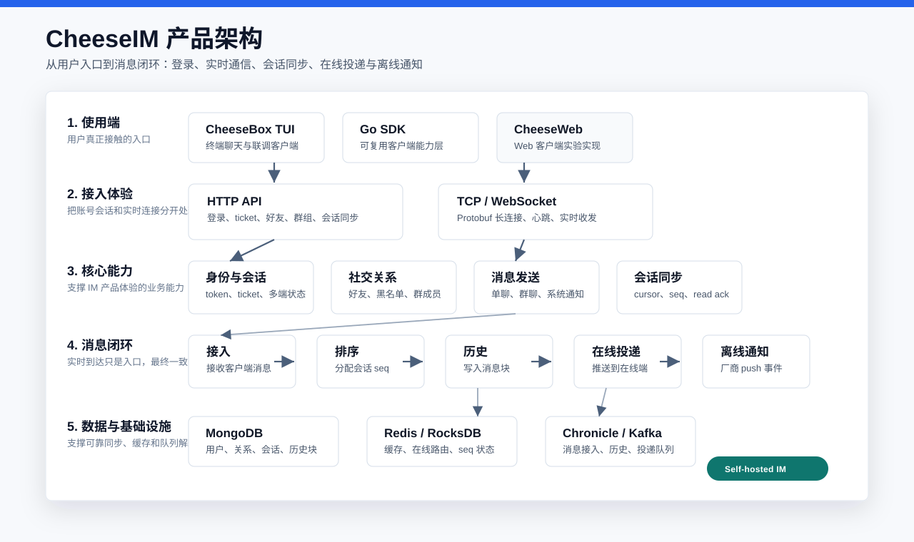
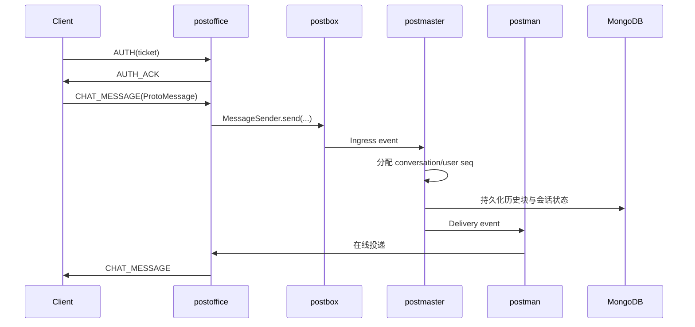

# CheeseIM

CheeseIM 是一个面向自托管场景的开源 IM 服务端项目。当前仓库包含 Java 服务端、Go Client SDK、CheeseBox TUI 客户端以及配套文档。服务端采用模块化拆分：HTTP API、鉴权会话、业务域服务、长连接网关、消息接入、消息编排、推送分发分别由独立模块承担；开发环境优先使用 `bootstrap-all` 以单进程方式启动完整链路。

[English](README.en.md)

## 架构

下图按产品体验组织层级：从使用端和接入体验出发，再展开 IM 核心能力、消息闭环和数据支撑。



### 消息链路



## 模块定义

| 模块 | 职责 |
| --- | --- |
| `server/api-server` | 统一 HTTP 入口。Controller 只处理 REST 入参、鉴权 Principal、Facade 编排和 Response 封装，不把 HTTP Response 模型下沉到业务 Service。 |
| `server/authcenter` | 访问令牌、刷新令牌、WS/TCP ticket、会话生命周期、设备踢下线、连接鉴权。 |
| `server/business` | 用户、好友、黑名单、群成员、会话、同步点等业务域服务实现；使用 JetCache 做业务缓存。 |
| `server/postoffice` | TCP/WS 长连接网关。负责 Protobuf 编解码、连接管理、在线路由、心跳、踢下线和在线投递。 |
| `server/postbox` | 消息发送入口与历史查询入口。实现 `MessageSender`，发布 ingress event，并对外提供历史消息查询能力。 |
| `server/postmaster` | 消息编排核心。消费 ingress event，分配会话序列，写入历史块，维护用户会话序列范围，并生成投递事件。 |
| `server/postman` | 投递与离线推送模块。消费 delivery/offline push event，调用 `postoffice` 在线投递或走 vendor push。 |
| `server/common-api` | 跨模块 API、领域模型、枚举、事件模型、Protobuf 协议定义。 |
| `server/common-core` | 通用基础设施：Mongo Repository、队列抽象、JetCache 配置、通知发送、序列状态、工具类。 |
| `server/config` | Spring/YAML 配置集合，包含 all-in-one 与各模块配置片段。 |
| `server/bootstrap-all` | 开发与本地联调推荐入口。单 JVM 装配所有模块，Dubbo 走 injvm。 |
| `sdks/go` | Go 侧通用 IM Client SDK，供 CheeseBox 和后续其他应用复用。 |
| `apps/CheeseBox` | 基于 Go SDK 的 TUI 聊天应用，用于真实端到端联调。 |
| `apps/CheeseWeb` | React Web 客户端实验实现。当前不是主要联调入口，状态以代码和自身测试为准。 |

## 当前状态

| 范围 | 状态 | 说明 |
| --- | --- | --- |
| Java 服务端 | 核心链路已实现 | all-in-one 本地联调是当前主线；分模块部署配置仍需按目标环境校准并验证。 |
| Go SDK | 可用于真实联调 | 封装 HTTP 鉴权、ticket、TCP 长连接、消息发送、会话同步和好友/群组查询。 |
| CheeseBox TUI | 联调客户端可用 | 支持登录、会话/好友/群组导航、文本消息、实时事件、历史同步和 gap repair；好友请求处理、会话删除入口、富媒体等仍需补齐。 |
| CheeseWeb | 实验客户端 | 保留为 Web 侧实现与测试，不作为当前 README 的主线启动路径。 |
| 文档 | 正在收敛 | 根 README、模块 README、协议文档和 client runbook 是优先维护入口；历史 plans/specs 只作过程参考。 |

## 已实现能力

- HTTP 鉴权：登录、刷新、登出、设备踢下线、WS/TCP ticket 签发。
- TCP/WS 长连接：统一使用 Protobuf envelope，支持鉴权、心跳、消息发送 ACK、服务端下行消息、错误响应。
- 单聊/群聊消息链路：消息接入、选项判断、会话序列分配、历史块持久化、在线投递、离线推送事件。
- 会话同步：可见会话列表、会话 ID hash、会话 max seq、read snapshot、按 seq range 拉取历史消息、read seq ACK。
- 社交关系：用户设置、好友申请、好友关系、黑名单、群成员查询。
- 通知体系：`NotificationSender` 基于 `MessageSender` 发送系统通知，通知规则集中在 common-core。
- 客户端侧：`sdks/go` 提供通用 IM Client 能力，CheeseBox 作为 TUI 应用集成该 SDK。

## 关键约束

- `api-server` 是 HTTP 出入口。Request/Response 模型只应存在于 `api-server`，底层 Service 返回领域模型或基础结果。
- `authcenter` 拥有令牌、ticket、session 与连接鉴权逻辑；`postoffice` 只持有连接态和在线路由。
- TCP/WS 协议以 `common-api/src/main/proto/message_protocol.proto` 为准，不再使用 JSON 命令体。
- 会话列表不再持有最新消息快照。最后一条消息由客户端缓存或通过同步/历史消息接口按需加载。
- 消息 seq 不应使用通用 `SequenceIdGenerator` 替代。会话消息序列需要 Redis/RocksDB 区间分配状态与 Mongo 持久化状态协同。
- 集群部署需要 Redis 承担分布式缓存与序列分配状态；单机降级可使用本地 RocksDB 状态，但不能跨节点保证全局一致。
- 当前本地开发推荐 `bootstrap-all`。独立模块启动前需要校准启动类中的 `spring.config.name` 与 `server/config/src/main/resources/application-*.yml` 文件名，并接入真实 Dubbo 注册中心。

## 开发环境

推荐版本：

- JDK 17
- Gradle Wrapper：使用仓库内 `./gradlew`
- MongoDB 6.x+
- Redis 6.x+
- 可选：Kafka / Nacos。all-in-one 默认使用 Chronicle 队列和 injvm Dubbo，本地开发可先不启 Kafka/Nacos。
- Go 1.22+：用于 `sdks/go` 与 `apps/CheeseBox`

启动中间件示例：

```bash
cd distro/docker
docker compose -f docker-compose.middleware.yml up -d
```

该 compose 文件当前包含 Nacos、Kafka、Zookeeper、Kafka Console；MongoDB 和 Redis 需要单独启动，或使用本机已有实例。

## 启动服务端

推荐使用 all-in-one：

```bash
cd server
./gradlew :bootstrap-all:bootRun
```

默认端口：

| 服务 | 端口 |
| --- | --- |
| HTTP API | `18079` |
| WebSocket | `5147`，默认 path `/ws` |
| TCP | `5148` |
| Dubbo | all-in-one 使用 injvm，不开放固定 Dubbo 端口 |

常用 API 示例：

```bash
curl -sS -X POST http://127.0.0.1:18079/api/auth/login \
  -H 'Content-Type: application/json' \
  -d '{"userId":"u100","platformId":1,"deviceId":"dev-u100","clientVersion":"dev"}'
```

```bash
curl -sS -X POST http://127.0.0.1:18079/api/im/ws-ticket \
  -H "Authorization: Bearer ${ACCESS_TOKEN}"
```

分模块部署目标端口在配置中定义：

| 模块 | 配置文件 | 默认 Dubbo 端口 |
| --- | --- | --- |
| `authcenter` | `application-authcenter.yml` / `module-authcenter.yml` | `20884` |
| `business` | `application-business.yml` / `module-business.yml` | `20885` |
| `postoffice` | `application-postoffice.yml` / `module-postoffice.yml` | `20880` |
| `postbox` | `application-postbox.yml` / `module-postbox.yml` | `20882` |
| `postmaster` | `application-postmaster.yml` / `module-postmaster.yml` | `20881` |
| `postman` | `application-postman.yml` / `module-postman.yml` | `20883` |

## 启动 CheeseBox

CheeseBox 是真实 TUI 客户端，不是 mock client。它通过 Go SDK 登录 HTTP API、申请 ticket，并连接 TCP/WS 长连接。

```bash
cd sdks/go
go test ./...
```

```bash
cd apps/CheeseBox
go test ./...
go run ./cmd/cheesebox
```

默认服务端地址以 CheeseBox 配置为准；本地 all-in-one 通常使用 `http://127.0.0.1:18079` 和 `127.0.0.1:5148`。

## 测试指南

服务端编译：

```bash
cd server
./gradlew compileJava
```

按模块执行测试：

```bash
./gradlew :api-server:test
./gradlew :business:test
./gradlew :postoffice:test
./gradlew :postmaster:test
./gradlew :postbox:test
./gradlew :postman:test
```

端到端联调建议：

1. 启动 MongoDB 与 Redis。
2. 启动 `:bootstrap-all:bootRun`。
3. 启动两个 CheeseBox 客户端，分别登录不同用户。
4. 通过好友/会话列表发起聊天。
5. 验证在线消息投递、重启客户端后的历史同步、read seq ACK。

如果只修改文档，至少执行：

```bash
git diff --check
```

## 文档状态

优先维护的文档：

- `README.md`：项目入口、服务端架构、模块边界、启动与测试指南。
- `README.en.md`：英文项目入口，应与中文 README 保持同级信息。
- `docs/CheeseIM-数据同步设计文档.md`：当前会话/消息同步设计说明。
- `docs/client-runbook.md`：Go SDK 与 CheeseBox 联调入口。
- `server/postoffice/docs/TCP_PROTOCOL.md`：TCP/WS Protobuf 协议说明。
- `server/postoffice/README.md`、`server/postbox/README.md`、`server/postmaster/README.md`、`server/postman/README.md`：模块职责说明。
- `apps/CheeseBox/README.md`、`apps/CheeseBox/arch.md`：TUI 客户端说明。

参考型文档：

- `server/postmaster/docs/ConversationArch.md`、`server/postmaster/docs/SeqArch.md`：会话和 seq 设计背景。
- `docs/handoff/**`：阶段性交接记录，用于理解当时改动背景，不替代当前代码事实。
- `server/docs/architecture/**`：早期服务端架构草案和专题设计，阅读时需要和当前模块代码核对。
- `docs/superpowers/specs/**` 与 `docs/superpowers/plans/**`：历史重构过程记录，可能包含阶段性方案，不能替代当前代码事实。
- `server/docs/superpowers/specs/**` 与 `server/docs/superpowers/plans/**`：服务端历史实施计划和规格记录，仅作追溯参考。

## 仓库结构

```text
.
├── apps
│   ├── CheeseBox          # TUI 客户端，当前主要真实联调客户端
│   └── CheeseWeb          # Web 客户端实验实现
├── distro                 # 本地中间件与辅助脚本
├── docs                   # 设计文档与历史方案
├── sdks
│   └── go                 # Go IM Client SDK
└── server                 # Java 服务端
    ├── api-server
    ├── authcenter
    ├── business
    ├── bootstrap-all
    ├── common-api
    ├── common-core
    ├── config
    ├── postbox
    ├── postman
    ├── postmaster
    └── postoffice
```
