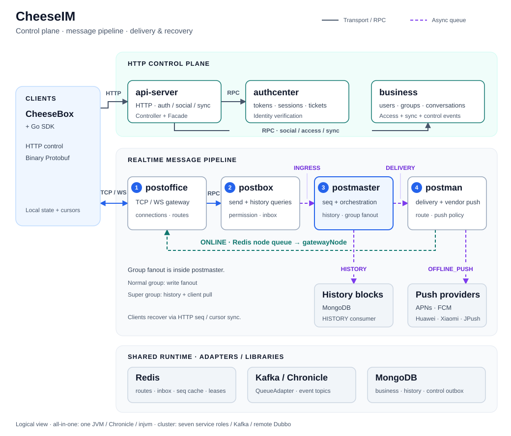
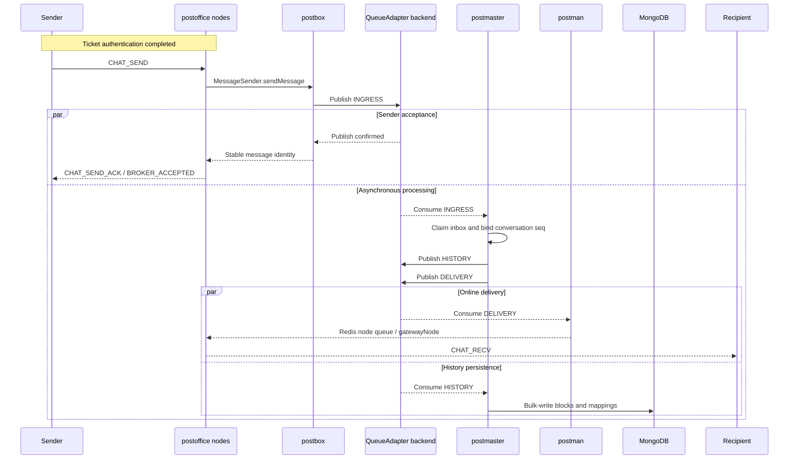

# CheeseIM

**面向自托管的模块化即时通信系统。**

Java 服务端以 HTTP 控制面、TCP/WS 实时通道和异步消息主干分工，配套 Go Client SDK 与 CheeseBox TUI，支持从登录、发消息到历史补拉的双端联调。

[English](README.en.md) · [架构](#架构) · [快速开始](#快速开始) · [能力与验收](#能力与验收) · [模块与仓库](#模块与仓库) · [文档](#开发与文档)

- **清晰的消息分工**：`postoffice` 接连接，`postbox` 接消息，`postmaster` 编排与排序，`postman` 执行投递。
- **可恢复的状态设计**：稳定消息身份、会话 seq、历史块、设备回执和控制事件 cursor 各有明确职责。
- **一套代码，两种运行方式**：本地用 `bootstrap-all` 单 JVM 联调；集群用独立服务、Kafka 和共享状态。

项目当前处于持续联调与验收阶段。核心链路已有实现，集群容量、故障恢复和部分客户端能力仍在推进；当前进展见 [修复验收账本](docs/review-remediation-plan-2026-09-30.md)。

## 架构

### 服务总览



**读图方式：实线是传输/RPC，虚线是异步队列；灰色节点是存储或外部厂商。** 这是逻辑服务视图，不是 Gradle 依赖图，也不表示每个节点都必须单独部署。

1. **控制面**：客户端经 `api-server` 登录、签票、管理社交关系和同步；鉴权归 `authcenter`，业务与访问权限归 `business`。历史与撤回查询分别调用 `postbox`、`postmaster`。
2. **消息主干**：客户端经 `postoffice → postbox → INGRESS → postmaster → DELIVERY → postman`。会话 seq 只走唯一 allocator，再推进用户维度水位。
3. **投递与补齐**：在线消息经 Redis 节点队列送到目标 `gatewayNode` 的 `postoffice`；离线事件进入厂商推送。历史通过 `HISTORY` consumer 异步写入 MongoDB，客户端经 HTTP 按 seq / 控制事件 cursor 补拉。

普通群由 `postmaster` 内的 fanout worker 写扩散，超级群采用历史存储与客户端拉取。图中省略了辅助鉴权 RPC、结果回报和控制事件补偿的全部连线，详细边界见 [架构评估](server/docs/architecture/ASSESSMENT.md) 与 [协议说明](docs/PROTOCOL.md)。

### 消息成功意味着什么？

| 状态 | 已经确认 | 尚不代表 |
| --- | --- | --- |
| `CHAT_SEND_ACK / BROKER_ACCEPTED` | 发送入口已确认入队，返回稳定消息身份 | 历史已落库、对端已收到 |
| 设备送达回执 `CHAT_DELIVERY` | 客户端显式确认设备送达高水位；CheeseBox 在消息落盘后发送 | 用户已阅读 |
| 已读回执 `CHAT_READ` | 用户已读水位推进 | 所有设备都已展示该回执 |

<details>
<summary><strong>展开：普通持久化消息的时序</strong></summary>


```mermaid
sequenceDiagram
    participant S as Sender
    participant G as postoffice nodes
    participant B as postbox
    participant Q as QueueAdapter backend
    participant M as postmaster
    participant P as postman
    participant DB as MongoDB
    participant R as Recipient

    Note over S,G: Ticket authentication completed
    S->>G: CHAT_SEND
    G->>B: MessageSender.sendMessage
    B->>Q: Publish INGRESS
    par Sender acceptance
        Q-->>B: Publish confirmed
        B-->>G: Stable message identity
        G-->>S: CHAT_SEND_ACK / BROKER_ACCEPTED
    and Asynchronous processing
        Q-->>M: Consume INGRESS
        M->>M: Claim inbox and bind conversation seq
        M->>Q: Publish HISTORY
        M->>Q: Publish DELIVERY
        par Online delivery
            Q-->>P: Consume DELIVERY
            P-->>G: Redis node queue / gatewayNode
            G-->>R: CHAT_RECV
        and History persistence
            Q-->>M: Consume HISTORY
            M->>DB: Bulk-write blocks and mappings
        end
    end
```

`HISTORY` consumer 属于 `postmaster`；发送 ACK 回包与后台消费可交错，历史写入与在线投递也各自异步推进。时序图不承诺落库先于接收。Kafka 和 Chronicle 通过同一队列 port 接入，但可靠性语义不同，见 [队列边界](server/infra-queue/ARCH.md)。

</details>

## 快速开始

### 先跑通双端链路

准备 **JDK 17、Go 1.24.2、Docker 与 Docker Compose**，从仓库根目录执行：

```bash
./distro/docker/run-cheesebox-e2e.sh
```

脚本启动 MongoDB 单节点副本集与 Redis，配置本地 JWT / identity assertion，启动 all-in-one，并运行真实双用户测试：

**登录 → ticket → TCP 鉴权 → 发消息与 broker ACK → 对端接收 → 送达/已读回执 → 撤回 → 历史最终可见。**

默认退出时停止服务端和中间件；`CHEESEIM_E2E_KEEP_MIDDLEWARE=1` 只保留中间件，便于后续手工调试。脚本和手工步骤详见 [客户端联调手册](docs/client-runbook.md)。

### 使用 CheeseBox 手工聊天

先准备 MongoDB **副本集**与 Redis。会话创建存在 Mongo 事务路径，单机非副本集 Mongo 不能代替这一前置条件。

**终端 1：启动服务端。** 从仓库根目录执行，密钥必须在启动前设置：

```bash
export CHEESEIM_AUTH_JWT_SECRET='local-jwt-secret-at-least-32-bytes'
export CHEESEIM_LOGIN_ASSERTION_ENABLED=true
export CHEESEIM_LOGIN_ASSERTION_SECRET='local-integration-secret-at-least-32-bytes'
export MONGODB_URI='mongodb://127.0.0.1:27017/cheese_im?replicaSet=rs0'

cd server
./gradlew :bootstrap-all:bootRun
```

**终端 2：签发本地 assertion 并启动 TUI。** 使用与服务端相同的开发签发密钥：

```bash
export CHEESEIM_LOGIN_ASSERTION_SECRET='local-integration-secret-at-least-32-bytes'
cd apps/CheeseBox
go run ./cmd/dev-assertion -user user-1
go run ./cmd/cheesebox
```

在登录框输入 `user-1` 和刚生成的 assertion。assertion 一次性使用、有效期 60 秒，过期后重新签发。在另一个终端以 `user-2` 登录，输入 `/chat user-1` 即可开始单聊。

上述密钥和签发工具仅用于本地联调；生产 assertion 由账户域提供，客户端不持有签发密钥。地址、Mongo 副本集初始化和排查步骤见 [客户端联调手册](docs/client-runbook.md)。

| 本地入口 | 默认地址 |
| --- | --- |
| HTTP | `http://127.0.0.1:18079` |
| TCP | `127.0.0.1:5148` |
| WebSocket | `ws://127.0.0.1:5147/ws`，Binary Protobuf |

<details>
<summary>HTTP 登录与签票示例</summary>

服务端登录需要 `identityAssertion`，仅传 `userId` 不构成身份认证。将新生成的 assertion 设置为 `IDENTITY_ASSERTION`：

```bash
curl -sS -X POST http://127.0.0.1:18079/api/auth/login \
  -H 'Content-Type: application/json' \
  -d "{\"userId\":\"user-1\",\"identityAssertion\":\"${IDENTITY_ASSERTION}\",\"platformId\":1,\"deviceId\":\"dev-user-1\",\"clientVersion\":\"dev\"}"

# 将登录结果中的 accessToken 设置为 ACCESS_TOKEN 后申请长连接 ticket
curl -sS -X POST http://127.0.0.1:18079/api/im/ws-ticket \
  -H "Authorization: Bearer ${ACCESS_TOKEN}"
```

</details>

## 能力与验收

| 范围 | 当前能力 | 验收边界 / 待完善 |
| --- | --- | --- |
| 鉴权与连接 | assertion 登录、token 刷新、ticket、TCP/WS 鉴权、心跳、定向踢线 | 安全缓存、设备并发撤销及集群故障场景持续验收 |
| 消息与群 | 单聊/群聊、稳定身份、会话 seq、历史块、在线节点投递、群 fanout | 精确未读、存量身份迁移和跨资源恢复仍在推进 |
| 同步与控制事件 | 会话列表/设置、seq range、read snapshot、送达/已读/撤回及 cursor 补拉 | SDK 事件溢出、连接代际、同步覆盖区间和控制快照恢复待完善 |
| 社交 | 好友申请/处理、好友关系、黑名单、群成员查询 | 用户全局接收设置写入尚未接通 |
| 离线推送 | APNs、FCM、Huawei、Xiaomi、JPush adapter | 默认关闭；厂商凭据、payload 与失败重试闭环需单独联调 |
| 客户端 | Go SDK、CheeseBox 文本聊天与双端 E2E 场景 | TUI 富媒体及上传能力待补齐 |
| 运维 | OCI / Helm、指标、DLT 运维、容量与 chaos 脚本 | 部署基线不等于生产容量或灾备演练已验收 |

问题、修复状态和测试证据统一记录在 [修复验收账本](docs/review-remediation-plan-2026-09-30.md)，源码评审背景见 [整体 review](docs/code-review-2026-09-30.md)。

## 模块与仓库

```text
server/          Java 17 · Spring Boot 3 · Dubbo 3 · Gradle
sdks/go/         通用 Go Client SDK
apps/CheeseBox/  基于 SDK 的 TUI 与本地 assertion 工具
distro/          Docker / Helm / migration / 联调脚本
docs/            协议、部署、联调与验收文档
```

Java 工程有 **16 个 Gradle 子模块**，其中 7 个是可独立运行的业务服务。

| 服务 | 负责什么 |
| --- | --- |
| [`api-server`](server/api-server/ARCH.md) | HTTP Controller / Facade / Principal，显式装配远程 consumer |
| [`authcenter`](server/authcenter/ARCH.md) | 身份验证、token / refresh family、session 与 ticket |
| [`business`](server/business/ARCH.md) | 用户、好友、群、会话、访问权限、同步点与控制事件 |
| [`postoffice`](server/postoffice/ARCH.md) | TCP/WS、连接生命周期、在线路由与本节点投递 |
| [`postbox`](server/postbox/ARCH.md) | 消息发送接入、发送 inbox、INGRESS 发布与历史查询 |
| [`postmaster`](server/postmaster/ARCH.md) | seq / ingress 编排、HISTORY 消费、群 fanout 与用户水位 |
| [`postman`](server/postman/ARCH.md) | 在线结果聚合、离线与控制事件补偿、厂商推送 |

<details>
<summary>共享库、adapter 与运行入口</summary>

| 模块 | 角色 |
| --- | --- |
| `common-api` | RPC / 领域 / 事件 / 枚举契约与唯一 Protobuf 源 |
| `common-core` | Repository / Queue / Cache / State port、model 与通用状态机 |
| `infra-queue` / `infra-state` | Kafka/Chronicle、Redis/RocksDB 的运行时 adapter 与装配 |
| `storage-history` / `storage-business` | 消息历史与业务域的 Mongo adapter、Document 与索引 |
| `config` | 各入口的 Spring/YAML 配置 |
| `bootstrap-all` | 单 JVM 开发入口，Chronicle + injvm；仍需 Mongo / Redis |
| `ops-cli` | 独立 DLT 查询与受控 redrive 命令，非业务服务 |

共享库不独立部署，不是消息链路中的额外 RPC 跳数。Go SDK 与 CheeseBox 独立构建，不与 Java 工程共享运行时。

</details>

### 运行方式

| 方式 | 消息队列 / 服务调用 | 用途 |
| --- | --- | --- |
| all-in-one | Chronicle / Dubbo injvm | 本地联调；Redis 必需，完整历史与鉴权链路使用 Mongo |
| standalone | 按配置选择队列 / Nacos + Dubbo | 拆分模块本地联调 |
| cluster | Kafka / Nacos + Dubbo，共享 Mongo / Redis | 独立多副本部署与容量、故障验收 |

完整端口与环境变量见 [部署运行模式](docs/DEPLOYMENT.md)；`docker-compose.middleware.yml` 只包含 Nacos / Kafka 等拆分联调组件，Mongo / Redis 联调使用 `docker-compose.e2e.yml`。

## 开发与文档

**Java 编译与模块测试**（`server/`）：

```bash
./gradlew compileJava
./gradlew :authcenter:test :business:test :api-server:test :postoffice:test :postbox:test :postmaster:test :postman:test
```

**Go 测试**（分别在 `sdks/go/` 和 `apps/CheeseBox/`）：

```bash
go test ./...
```

Java 编译会执行架构边界门禁。客户端协议以 [`message_protocol.proto`](server/common-api/src/main/proto/message_protocol.proto) 为唯一源；只有协议变更时才需要重新生成，参见 [协议说明](docs/PROTOCOL.md)。

| 想了解什么 | 入口 |
| --- | --- |
| 全仓文档地图与状态 | [docs/INDEX.md](docs/INDEX.md) |
| 客户端联调、assertion 与 E2E | [客户端联调手册](docs/client-runbook.md) |
| TCP/WS 与 HTTP 边界 | [协议说明](docs/PROTOCOL.md) · [TCP/WS 协议](server/postoffice/docs/TCP_PROTOCOL.md) |
| 部署、端口与中间件 | [部署运行模式](docs/DEPLOYMENT.md) · [Helm](distro/helm/cheeseim/README.md) |
| 设计事实与修复进度 | [架构评估](server/docs/architecture/ASSESSMENT.md) · [验收账本](docs/review-remediation-plan-2026-09-30.md) |
| 指标、DLT 与恢复 | [可观测性](docs/observability.md) · [DLT](docs/dlt-runbook.md) · [灾备](docs/disaster-recovery.md) |
| 容量验证 | [perf runbook](server/perf/README.md) |
| 贡献与 Agent 约束 | [AGENTS.md](AGENTS.md) |

架构图使用自包含 [SVG 源文件](docs/assets/cheeseim-architecture.svg)，可在 [离线预览页](docs/assets/cheeseim-architecture.html) 检查。历史草案的状态以文档地图为准。
