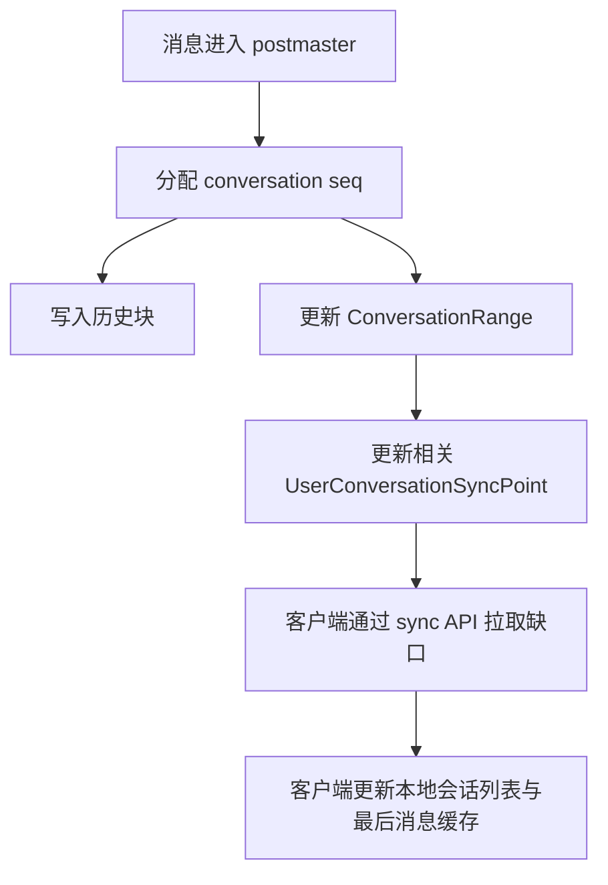

# Conversation Architecture

本文描述 CheeseIM 当前会话模型。历史版本中的 `latestMsg`、`latestMsgSeq`、服务端会话摘要等字段已经移除；客户端列表展示所需的最后一条消息由客户端缓存或通过消息同步接口按需拉取。

## 模型边界

| 模型 | 说明 |
| --- | --- |
| `UserConversation` | 用户视角的会话设置，例如置顶、免打扰、是否可见等。 |
| `ConversationRange` | 会话内消息 seq 范围，用于历史同步和补偿。 |
| `UserConversationSyncPoint` | 用户侧同步点，用于判断用户是否需要拉取某个会话的消息范围。 |

## 当前职责

- 会话列表只返回用户可见的会话关系和展示基础信息。
- 消息历史以 `postmaster` 写入的历史块为准。
- 会话最新消息不再由服务端冗余在 `Conversation` / `UserConversation` 中。
- read seq 通过专门同步/ACK 接口维护，不作为会话 DTO 的默认填充字段。
- 群聊新增成员时，需要区分已有会话用户和新增会话用户，正确推进 max seq 与同步点。

## 生命周期

## 单聊

- 单聊会话 ID 由双方用户 ID 稳定生成。
- 首次产生有效消息时，服务端确保双方存在 `UserConversation`。
- 列表标题由客户端或 API facade 基于 `targetId` 查询用户信息后展示，不依赖服务端保存的最新消息摘要。

## 群聊

- 群聊会话 ID 基于 groupId 生成。
- 新建群聊会话时，为群成员创建用户侧会话关系，并初始化同步点。
- 已存在会话的成员不重复创建 `UserConversation`，但需要根据当前 conversation range 推进用户侧 max seq。
- 对于不接收消息的成员，需要从 NotReceiveMessageUserIds 等排除集合中移除或避免继续积累错误状态。

## 一致性原则

- MongoDB 历史块是消息事实来源。
- Redis/JetCache/RocksDB 只承载缓存或序列分配状态，不能替代 MongoDB 的最终事实。
- 客户端收到实时消息时，如果 seq 不连续，应通过同步接口补拉缺口。
- 客户端重启后，以服务端 max seq/read snapshot 和本地缓存做差量同步。
