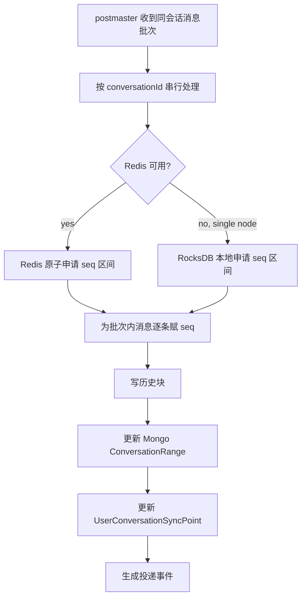

# Sequence Architecture

本文描述 CheeseIM 当前消息 seq 分配设计。实现需要同时支持集群部署和单机无 Redis 降级。

## 目标

- 同一 `conversationId` 内 seq 严格递增。
- 批量申请 seq 区间，减少 Redis/Mongo IO。
- MongoDB 保存最终进度，缓存或本地状态只作为加速层。
- 集群模式依赖 Redis 保证跨节点唯一分配。
- 单机模式允许 RocksDB 顶上 Redis 状态，但不承诺跨节点全局一致。

## 组件

| 组件 | 说明 |
| --- | --- |
| `ConversationSeqService` | `postmaster` 内的消息定序入口。 |
| Redis seq allocator | 集群模式下的区间申请状态。 |
| RocksDB seq state | 单机降级状态，用于无 Redis 本地运行。 |
| MongoDB `ConversationRange` | 持久化会话 seq 范围，是最终事实来源。 |
| `UserConversationSyncPoint` | 用户侧同步点，用于多端历史同步。 |

## 分配流程

## Redis 与 Lua

Redis 区间申请的核心要求是“读取当前值 + 增量推进 + 返回新旧边界”必须原子化。可以用 Lua 脚本实现，也可以用 Redis 原生命令组合实现，但前提是操作必须在 Redis 侧保持原子语义。

推荐策略：

- 简单 `INCRBY` 足以返回新区间上界时，可以由客户端计算 `startSeq = newMax - size + 1`。
- 如果还需要同时维护过期时间、初始化标记、多 key 元数据或对 Mongo snapshot 做校验，则使用 Lua 更清晰。
- 不要用 Jedis/Lettuce 的多次普通命令模拟原子流程，除非包在事务或脚本中，并确认返回边界无竞态。

## Mongo 一致性

- MongoDB 保存会话范围和历史块，是故障恢复时的基准。
- Redis/RocksDB 启动时可以从 Mongo 的 max seq 恢复或校准。
- 如果缓存状态小于 Mongo max seq，必须以 Mongo 为准推进缓存。
- 如果缓存状态大于 Mongo max seq，需要检查是否存在已分配但未落库的消息批次，不能直接回退。

## 客户端同步影响

- 服务端实时推送只是优化路径，不是唯一消息来源。
- 客户端发现 seq gap 时，按 conversationId 和 seq range 拉取历史。
- 多端登录时，每个端都基于用户侧 sync point 和本地缓存判断缺口。
